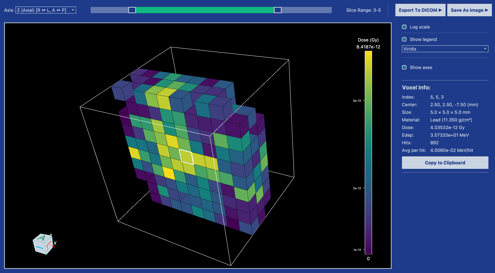
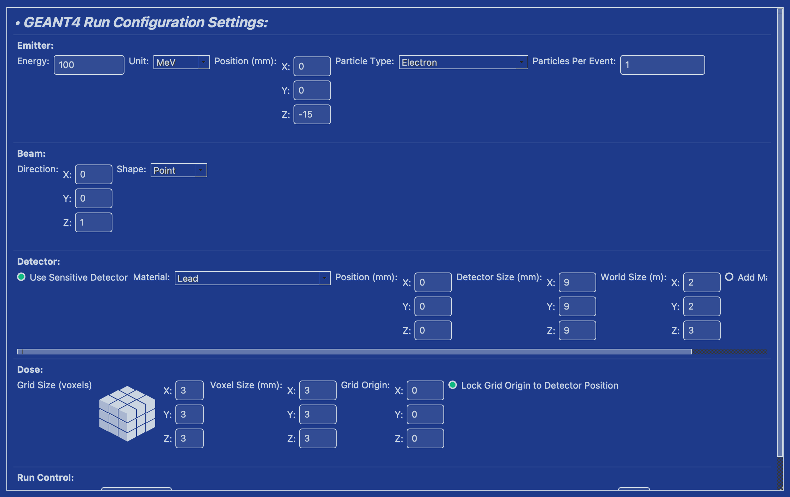
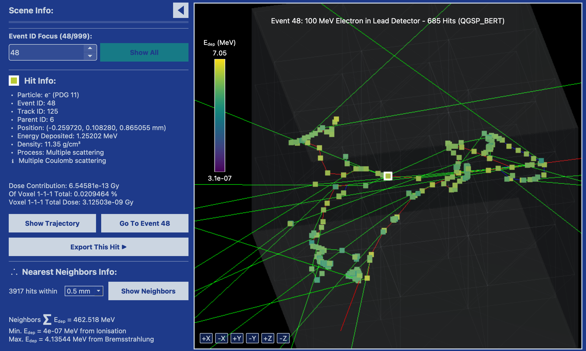

# Beam Research Toolkit

**A desktop GEANT4 app for particle-beam work — without compiling GEANT4.**

[Download](https://qirexscientific.com/downloads.html) · [Website](https://qirexscientific.com/) · [Pricing](https://qirexscientific.com/#subscribe) · [Issues](../../issues) · [Support](mailto:support@qirexscientific.com)

<p align="center">
  
</p>
<p align="center"><sub>3D dose viewer — sliced voxel grid from a Beam run</sub></p>

Beam Research Toolkit is the flagship product of [Qirex Scientific](https://qirexscientific.com/). It is a native desktop application (Linux AppImage / macOS Apple Silicon) that ships with a **managed GEANT4 instance**. You configure a run, simulate a beam in matter, inspect events and dose, and export files your lab already uses.

This repository is the **public home** for Beam: documentation, screenshots, release pointers, and an issue tracker. The application source is private. That is intentional.

---

## Who this is for

| You | Why Beam exists |
|---|---|
| **Just discovered particle physics** | You can see a beam interact with matter without a semester of compilers, CMake, and physics-list folklore. |
| **Student or instructor** | Labs and projects that should be about showers and dose, not toolchains. |
| **Working physicist / engineer** | Prototype a geometry, check a dose map, export ROOT or VTK — without writing glue code for every look at the data. |

If you already know GEANT4: Beam is the workstation layer you wish started on day one.  
If you do not: GEANT4 is the toolkit CERN and labs use to simulate how particles travel through detectors, shielding, and tissue. Beam runs that engine for you.

---

## What you can do in v1.0

- Configure and run a beam simulation with embedded GEANT4 — no separate install
- Explore events in 3D with nearest-neighbor filtering and event isolation
- Inspect energy deposition with histograms plus 2D, ISO, and 3D dose viewers
- Export in one click to **DICOM RT Dose, CSV, JSON, ROOT, ParaView, VTU**
- Save and reload configurations; use automation hooks and production color maps

<p align="center">
  
  &nbsp;
  
</p>
<p align="center"><sub>Run configuration · Interactive simulation explorer</sub></p>

---

## Download

Official builds live on the Qirex site. Do not expect a binary attached to every GitHub release unless we say so there.

| Platform | Build | Link |
|---|---|---|
| Linux x86_64 | AppImage | [Download Linux v1.0](https://downloads.qirexscientific.com/releases/linux/1.0/Beam_Research_Toolkit-x86_64.AppImage) |
| macOS Apple Silicon | Notarized `.app` in zip | [Download macOS v1.0](https://downloads.qirexscientific.com/releases/mac/1.0/Beam_Research_Toolkit-macos-arm64.zip) |

Requirements and GPG / Gatekeeper notes: [qirexscientific.com/downloads.html](https://qirexscientific.com/downloads.html)

**Linux (short path)**

```bash
chmod +x Beam_Research_Toolkit-x86_64.AppImage
./Beam_Research_Toolkit-x86_64.AppImage
```

**macOS (short path)**  
Unzip → drag to Applications → open (right-click → Open the first time if Gatekeeper asks).  
Requires macOS 13+ on Apple Silicon. Intel Macs are not supported in v1.0.

---

## Trial and the Research service

1. Download the app.
2. Use **every feature for 14 days**.
3. After the trial, subscribe **inside the app**: **€24 / month** or **€240 / year** (yearly saves €48 vs twelve months).

The website does not start a subscription. Sign-up and billing happen in Beam. After you log in from the app, [the account page](https://qirexscientific.com/account.html) can show status and open the Stripe billing portal.

The Research service funds the next physics lists, exporters, platforms, and fixes. That is how a serious tool stays past v1.0.

---

## Issues and support

This repo **is** the public issue tracker. Use it.

| Kind | Where |
|---|---|
| Bug, crash, bad export, wrong dose view | [Open a bug](../../issues/new?template=bug.yml) |
| Feature that would change a real workflow | [Request a feature](../../issues/new?template=feature.yml) |
| “I am new — is Beam even for me?” | [Ask a question](../../issues/new?template=question.yml) |
| Account / billing / license | [support@qirexscientific.com](mailto:support@qirexscientific.com) |

Please do **not** open pull requests that assume this tree contains the application source. It does not. See [SUPPORT.md](SUPPORT.md).

When you file a bug, include OS, Beam version, and what you expected vs what you got. A screenshot or the exported file helps more than a novel.

---

## What this repository is not

- Not the Beam source tree
- Not a place to paste GEANT4 internals or other people’s licensed data
- Not a homework-answer desk — we will help you *run the tool* and understand what the views mean

CERN open data, public phase-space files, and your own geometries are welcome as *examples you ran*. Do not upload datasets you do not have the right to share.

---

## Why a public GitHub if the code is private?

HEP people look here first. A product with no visible tracker looks like a black box. This repo exists so students and staff can:

- confirm the tool is real and maintained
- see how others get stuck
- download from a documented place
- talk to the people who ship Beam

If you want the science to spread — including people who just found out they care about showers, shielding, or energy research — the on-ramp has to be visible.

---

## Company

**Qirex Scientific OÜ** · Tallinn, Estonia · registry 17485177  
[qirexscientific.com](https://qirexscientific.com/) · [hello@qirexscientific.com](mailto:hello@qirexscientific.com)

© 2026 Qirex Scientific OÜ. Beam Research Toolkit is proprietary software. See [LICENSE](LICENSE).
